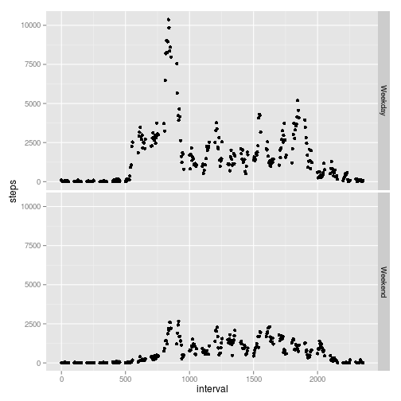

##Define the questions  
Note that the questions to be addressed were given in the [assignment] [1] and are included in the analysis sections below.  
[1]: [https://class.coursera.org/repdata-007/human_grading/view/courses/972596/assessments/3/submissions] "Assignment"  


##Obtain the data  

The data can be downloaded from the Course website [ https://d396qusza40orc.cloudfront.net/repdata%2Fdata%2Factivity.zip]   
or from the GitHub for the assignment [https://github.com/rdpeng/RepData_PeerAssessment1]  

Note that that GitHub should be forked to a personal copy, then downloaded to a local git, and this is assumed to have been done.


```r
setwd("~/edu/IntroDataScience/5-RR/assignment1/RepData_PeerAssessment1")
library(lubridate)
colclass<- c("numeric","character","numeric")
rawdata<-read.csv("./activity.csv",header=TRUE,colClasses=colclass)
hhmm<-sprintf("%2.2f",rawdata[,3]/100)
sum(is.na(hhmm)) # confirm none are NA
```

```
## [1] 0
```

```r
ts<-ymd(rawdata[,2])+hm(hhmm)
rawdata<-cbind(rawdata,ts)
```
 
Note that rawdata contains three columns, steps, data and interval:  
* steps is the count of the number of steps in that time interval  
* date is read in as a charter string in 'yyyy-mm-dd' format 
* interval is the 5 minute time slice for the sample shown as 24H clock time but stored as an integer.  Thus it is not a continuous variable, but jumps from (x)55 to(x+1)00 with no values between.  

As read in, rawdata is a relatively small dataset with the size and range shown:  

```r
object.size(rawdata)
```

```
## 495200 bytes
```

```r
summary(rawdata)
```

```
##      steps           date              interval   
##  Min.   :  0.0   Length:17568       Min.   :   0  
##  1st Qu.:  0.0   Class :character   1st Qu.: 589  
##  Median :  0.0   Mode  :character   Median :1178  
##  Mean   : 37.4                      Mean   :1178  
##  3rd Qu.: 12.0                      3rd Qu.:1766  
##  Max.   :806.0                      Max.   :2355  
##  NA's   :2304                                     
##        ts                     
##  Min.   :2012-10-01 00:00:00  
##  1st Qu.:2012-10-16 05:58:45  
##  Median :2012-10-31 11:57:30  
##  Mean   :2012-10-31 11:57:30  
##  3rd Qu.:2012-11-15 17:56:15  
##  Max.   :2012-11-30 23:55:00  
## 
```

##Analysis  
  
###Question 1. What is mean total number of steps taken per day? 
For this part of the assignment, you can ignore the missing values in the dataset.  

**Question 1a**  
Make a histogram of the total number of steps taken each day.  

```r
daily<-aggregate(rawdata[,1]~rawdata[,2], FUN=sum)
daily<-cbind(daily,ymd(daily[,1]))
plot(daily[,3],daily[,2])
```

 

**Question 1b** 
Calculate and report the mean and median total number of steps taken per day.   

```r
mean(daily[,2])
```

```
## [1] 10766
```

```r
median(daily[,2])
```

```
## [1] 10765
```

###Question 2. What is the average daily activity pattern?  

**Question 2a**  
Make a time series plot (i.e. type = "l") of the 5-minute interval (x-axis) and the average number of steps taken, averaged across all days (y-axis).  


```r
interval<-aggregate(rawdata[,1]~rawdata[,3],FUN=mean)
plot(interval[,1],interval[,2],type="l")
```

 

```r
#hhmm<-sprintf("%2.2f",interval[,1]/100)
#interval<-cbind(interval,hm(hhmm))
#plot(interval[,3],interval[,2],type="l")
```

**Question 2b**  
Which 5-minute interval, on average across all the days in the dataset, contains the maximum number of steps?  

This code finds the element with the maximum value, then looks up the time and value of the maximum.  

```r
summary(interval[,2])
```

```
##    Min. 1st Qu.  Median    Mean 3rd Qu.    Max. 
##    0.00    2.49   34.10   37.40   52.80  206.00
```

```r
maxat<-which.max(interval[,2])  # which interval number?
interval[maxat,1]  # which interval time ?
```

```
## [1] 835
```

```r
interval[maxat,2]  # what is the value?
```

```
## [1] 206.2
```

###Question 3. Imputing missing values

Note that there are a number of days/intervals where there are missing values (coded as NA). The presence of missing days may introduce bias into some calculations or summaries of the data.

**Question 3a**  
Calculate and report the total number of missing values in the dataset (i.e. the total number of rows with NAs).  
  

```r
sum(is.na(rawdata[,1]))  # number of steps  
```

```
## [1] 2304
```

```r
sum(is.na(rawdata[,2]))  # date  
```

```
## [1] 0
```

```r
sum(is.na(rawdata[,3]))  # interval  
```

```
## [1] 0
```
As can be seen from the sums above, only the number of steps variable has NA values.  

**Question 3b**  
Devise a strategy for filling in all of the missing values in the dataset. The strategy does not need to be sophisticated. For example, you could use the mean/median for that day, or the mean for that 5-minute interval, etc.  

First Confirm that all interval averages do contain valid data:   

```r
sum(is.na(interval[,1]))  # interval
```

```
## [1] 0
```

```r
sum(is.na(interval[,2]))  # average steps for the interval
```

```
## [1] 0
```

Since every interval does have valid data, a simple strategy of replacing the missing interval value with the average for that interval will have all the necessary values.  

**Question 3c**  
Create a new dataset that is equal to the original dataset but with the missing data filled in.  

```r
cleandata<-rawdata                              # create the nwew dataset
for (i in 1:length(cleandata[,1])) {            # walk through each element
    if (is.na(cleandata[i,1])) {                #    look for NA value
        int2fix <- cleandata[i,3]               #       find the interval time
        intvalno <- interval[,1] == int2fix     #       find the data in the average interval table
        cleandata[i,1] <- interval[intvalno,2]  #       write the average value over the NA
    }
}
sum(is.na(cleandata[,1]))                       # confirm no more NA's
```

```
## [1] 0
```

**Question 3d**  
Make a histogram of the total number of steps taken each day and Calculate and report the mean and median total number of steps taken per day. Do these values differ from the estimates from the first part of the assignment? What is the impact of imputing missing data on the estimates of the total daily number of steps? 

make the histogram as for Question 1a above

```r
daily<-aggregate(cleandata[,1]~cleandata[,2], FUN=sum)
daily<-cbind(daily,ymd(daily[,1]))
plot(daily[,3],daily[,2])
```

 

Calculate and report the mean and median total number of steps taken per day as was done for Question 1b above.  Also show the summary data for the raw and clean data sets.     

```r
mean(daily[,2])
```

```
## [1] 10766
```

```r
median(daily[,2])
```

```
## [1] 10766
```

```r
summary(rawdata[,1])
```

```
##    Min. 1st Qu.  Median    Mean 3rd Qu.    Max.    NA's 
##     0.0     0.0     0.0    37.4    12.0   806.0    2304
```

```r
summary(cleandata[,1])
```

```
##    Min. 1st Qu.  Median    Mean 3rd Qu.    Max. 
##     0.0     0.0     0.0    37.4    27.0   806.0
```
The mean and median do not differ because more than half of the data in the dataset is zero, and so more than half of the NAs were replaced with zero values.  Looking at the summary data, we see only two changes, all NA values were replaced, and the third quartile has increased in value, but this was not a large enough change to impact either the mean or the median.


###uestion 4. Are there differences in activity patterns between weekdays and weekends?  

For this part the weekdays() function may be of some help here. Use the dataset with the filled-in missing values for this part.

**Question 4a**  
Create a new factor variable in the dataset with two levels – “weekday” and “weekend” indicating whether a given date is a weekday or weekend day.  

This code modifies the cleandata set to include a new factor variable (wkdef - WeeK Day or End Factor) with the values "Weekday" or "Weekend", and displays summary information about it.    


```r
wkday<-weekdays(cleandata$ts,TRUE)
wkde<-gsub("Mon|Tue|Wed|Thu|Fri","Weekday", wkday)
wkde<-gsub("Sun|Sat","Weekend", wkde)
wkdef<-as.factor(wkde)
cleandata<-cbind(cleandata,wkdef)
summary(cleandata)
```

```
##      steps           date              interval   
##  Min.   :  0.0   Length:17568       Min.   :   0  
##  1st Qu.:  0.0   Class :character   1st Qu.: 589  
##  Median :  0.0   Mode  :character   Median :1178  
##  Mean   : 37.4                      Mean   :1178  
##  3rd Qu.: 27.0                      3rd Qu.:1766  
##  Max.   :806.0                      Max.   :2355  
##        ts                          wkdef      
##  Min.   :2012-10-01 00:00:00   Weekday:12960  
##  1st Qu.:2012-10-16 05:58:45   Weekend: 4608  
##  Median :2012-10-31 11:57:30                  
##  Mean   :2012-10-31 11:57:30                  
##  3rd Qu.:2012-11-15 17:56:15                  
##  Max.   :2012-11-30 23:55:00
```

**Question 4b**  
Make a panel plot containing a time series plot (i.e. type = "l") of the 5-minute interval (x-axis) and the average number of steps taken, averaged across all weekday days or weekend days (y-axis).  


```r
library(ggplot2)
interval<-aggregate(cleandata[,1]~cleandata[,3]+cleandata[,5],FUN=sum) 
names(interval)<-c("interval","wkdef","steps")
p<-qplot(interval,steps,data=interval,facets=wkdef~.)
print(p)
```

 
There is a significant difference, with Weekdays being more active, especially during the morning rush.  


## Environment  

### R Session Information  

```r
sessionInfo()
```

```
## R version 3.1.2 (2014-10-31)
## Platform: i686-pc-linux-gnu (32-bit)
## 
## locale:
##  [1] LC_CTYPE=en_US.UTF-8       LC_NUMERIC=C              
##  [3] LC_TIME=en_US.UTF-8        LC_COLLATE=en_US.UTF-8    
##  [5] LC_MONETARY=en_US.UTF-8    LC_MESSAGES=en_US.UTF-8   
##  [7] LC_PAPER=en_US.UTF-8       LC_NAME=C                 
##  [9] LC_ADDRESS=C               LC_TELEPHONE=C            
## [11] LC_MEASUREMENT=en_US.UTF-8 LC_IDENTIFICATION=C       
## 
## attached base packages:
## [1] stats     graphics  grDevices utils     datasets  methods   base     
## 
## other attached packages:
## [1] ggplot2_1.0.0   lubridate_1.3.3 knitr_1.6      
## 
## loaded via a namespace (and not attached):
##  [1] colorspace_1.2-4 digest_0.6.4     evaluate_0.5.5   formatR_1.0     
##  [5] grid_3.1.2       gtable_0.1.2     htmltools_0.2.4  labeling_0.3    
##  [9] MASS_7.3-35      memoise_0.2.1    munsell_0.4.2    plyr_1.8.1      
## [13] proto_0.3-10     Rcpp_0.11.2      reshape2_1.4     rmarkdown_0.2.49
## [17] scales_0.2.4     stringr_0.6.2    tools_3.1.2      yaml_2.1.13
```
### R-Studio
Version 0.98.953 – © 2009-2013 RStudio, Inc.  
